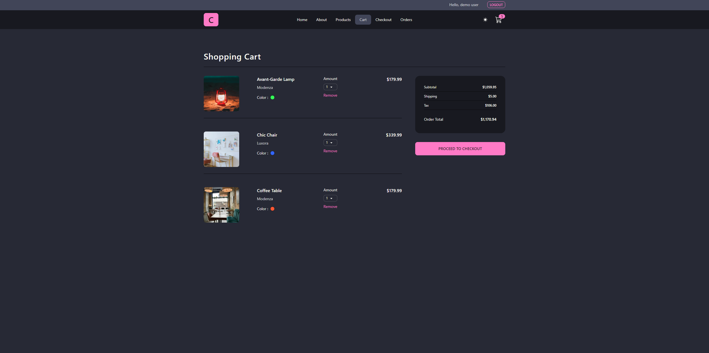

[](https://opensource.org/licenses/MIT)
[](https://dwwm-react-comfy-store.netlify.app/)

# React Comfy Store

## [Demo](https://dwwm-react-comfy-store.netlify.app/)

## Project description

React Comfy Store is an e-commerce application built with React.js. It offers a fluid and responsive user experience, with features such as product management, a shopping cart, and user authentication. The application is designed to be easily extensible and maintainable, thanks to a well thought-out architecture and the use of modern technologies.

## Features

- List of products
- Shopping cart
- Authentication
- etc...

## Screenshots



## Table of contents

- [Installation](#installation)
- [Usage](#usage)
- [Technologies used](#technologies-used)
- [License](#license)
- [Contact](#contact)

## Installation

Clone the repository and install the dependencies.

```bash
git clone https://github.com/Fixito/react-comfy-store.git
cd react-comfy-store
npm install
```

## Usage

To start the development server :

```bash
npm run dev
```

## Technologies used

- React
- Redux Toolkit
- React Query
- TailwindCSS

## License

This project is licensed under the MIT License.

## Contact

If you have any questions, please contact me at [thomas_3004@hotmail.fr](mailto:thomas_3004@hotmail.fr)
